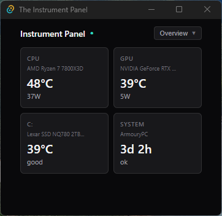
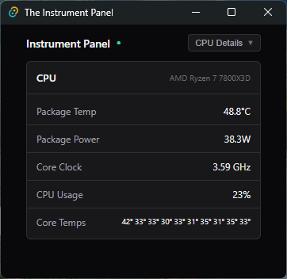
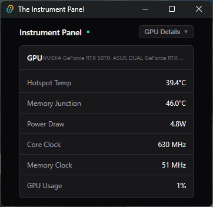
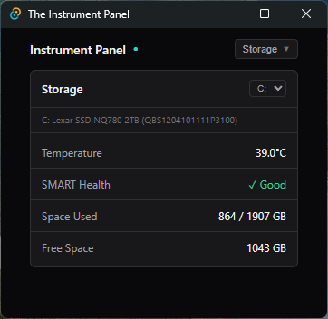
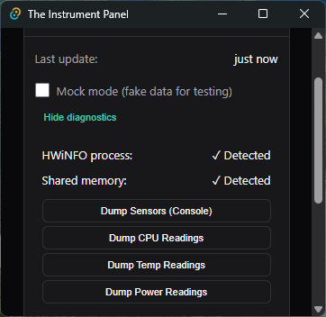

# The Instrument Panel — Desktop Hardware Monitor


A lightweight desktop hardware monitoring application built with **Tauri 2**, **React 19**, **TypeScript**, and **Rust**. Displays real-time CPU, GPU, storage, and system metrics by reading sensor data from **HWiNFO** shared memory.

This project demonstrates cross-platform desktop development with Rust backend, React frontend, and Windows system API integration.

---

> **⚠️ Portfolio Project Disclaimer**
>
> This application is provided as a portfolio demonstration of my development work. It is designed specifically for my hardware configuration (AMD Ryzen 7 7800X3D, NVIDIA GeForce RTX 5070) and reads data from HWiNFO's shared memory interface.
>
> **No guarantees are made that this will work on your system.** Sensor names, indices, and data formats vary significantly between hardware configurations. The code is provided for review purposes to demonstrate Tauri/Rust/React development patterns. This is possibly the only legitmate use of 'Works on my machine!' that I can think of.

---

## 📸 Screenshots

### 🟦 Overview Dashboard
<p>Quick glance at CPU, GPU, Storage, and System status.</p>
<div style="display: flex; gap: 12px; margin-bottom: 20px;">
  
</div>

### 🟧 CPU Details
<p>Package temperature, power draw, clock speed, and usage.</p>
<div style="display: flex; gap: 12px; margin-bottom: 20px;">
  
</div>

### 🟨 GPU Details
<p>Hotspot temperature, memory junction, power draw, clocks, and usage.</p>
<div style="display: flex; gap: 12px; margin-bottom: 20px;">
  
</div>

### 🟩 Storage Details
<p>Drive temperature, SMART health, and disk space for all detected drives.</p>
<div style="display: flex; gap: 12px; margin-bottom: 20px;">
  
</div>

### 🟦 Diagnostic View
<p>Development diagnostics panel showing connection status and debug tools to dump sensor readings to the Tauri console.</p>
<div style="display: flex; gap: 12px; margin-bottom: 20px;">
  
</div>

---

## 🚀 Features

### 📊 Real-Time Hardware Monitoring
- Live sensor data polling (1-second intervals)
- CPU package temperature, power, clock speed, and usage
- GPU hotspot temperature, memory junction, power draw, and utilization
- Per-core CPU temperatures (AMD CCD support)
- GPU VRAM usage and fan speed

### 💾 Storage Monitoring
- S.M.A.R.T. health status for all drives
- Drive temperature monitoring
- Disk space usage (total/free)
- Multi-drive support with drive selector

### 🖥️ System Information
- System uptime tracking
- Fan status monitoring
- PC name display

### 🎨 Clean, Minimal UI
- Dark theme optimized for desktop widgets
- Compact card-based layout
- Warning indicators for high temperatures
- View switching (Overview, CPU, GPU, Storage)

---

## 🛠️ Tech Stack

| Layer | Technology |
|-------|------------|
| Framework | **Tauri 2** (Rust + WebView) |
| Frontend | **React 19**, TypeScript 5 |
| Backend | **Rust** (Windows API integration) |
| Styling | **CSS** (custom dark theme) |
| Data Source | **HWiNFO** Shared Memory |
| Build | **Vite 6** |
| Packaging | **NSIS / MSI** installers |

---

## 📦 Prerequisites

- **Windows 10/11** (required for HWiNFO shared memory)
- **HWiNFO** installed and running with Shared Memory Support enabled
  - Open HWiNFO → Settings → Enable "Shared Memory Support"
- **Node.js 18+** and npm (for development)
- **Rust toolchain** (for development)

---

## 🔧 HWiNFO Setup

1. Download and install [HWiNFO](https://www.hwinfo.com/)
2. Launch HWiNFO in **Sensors-only** mode
3. Go to **Settings** (gear icon)
4. Check **"Shared Memory Support"**
5. Click OK and restart HWiNFO if prompted

The application reads from the shared memory segment `Global\HWiNFO_SENS_SM2`.

---

## 🏗️ Building from Source

### Development

```bash
# Clone the repository
git clone https://github.com/JamesD9406/instrument-panel.git
cd instrument-panel/instrument-panel

# Install dependencies
npm install

# Run in development mode
npm run tauri dev
```

### Production Build

```bash
# Build the application
npm run tauri build
```

Output locations:
- **Executable:** `src-tauri/target/release/instrument-panel.exe`
- **NSIS Installer:** `src-tauri/target/release/bundle/nsis/The Instrument Panel_x.x.x_x64-setup.exe`
- **MSI Installer:** `src-tauri/target/release/bundle/msi/The Instrument Panel_x.x.x_x64_en-US.msi`

---

## 📁 Project Structure

```
instrument-panel/
├── src/                          # React frontend
│   ├── components/
│   │   ├── views/
│   │   │   ├── OverviewView.tsx  # Dashboard with all cards
│   │   │   ├── CpuDetailView.tsx # CPU detailed metrics
│   │   │   ├── GpuDetailView.tsx # GPU detailed metrics
│   │   │   └── StorageDetailView.tsx
│   │   ├── DataSourceCard.tsx    # Connection status & debug
│   │   ├── MetricCard.tsx        # Reusable metric display
│   │   └── ViewSelector.tsx      # View navigation
│   ├── hooks/
│   │   ├── useSensorData.ts      # Sensor polling hook
│   │   └── useSettings.ts        # App settings
│   ├── types/
│   │   └── sensors.ts            # TypeScript interfaces
│   └── App.tsx
│
├── src-tauri/                    # Rust backend
│   └── src/
│       ├── hwinfo/
│       │   ├── shared_memory.rs  # HWiNFO data parsing
│       │   ├── types.rs          # Rust data structures
│       │   ├── process.rs        # HWiNFO process detection
│       │   └── mock.rs           # Test data generator
│       ├── commands.rs           # Tauri IPC commands
│       └── lib.rs
│
└── package.json
```

---

## 🔍 How It Works

### Data Flow

```
HWiNFO Process
    ↓
Shared Memory (Global\HWiNFO_SENS_SM2)
    ↓ (Rust reads via Windows API)
shared_memory.rs → parse sensors & readings
    ↓
Tauri IPC (invoke "get_sensor_data")
    ↓
useSensorData hook (polls every 1000ms)
    ↓
React components render metrics
```

### Sensor Detection

The Rust backend automatically detects:
- **CPU:** Sensors containing "Ryzen", "Intel", or "Core i"
- **GPU:** Sensors containing "GeForce", "RTX", "GTX", or "Radeon"
- **Storage:** Sensors starting with "S.M.A.R.T."

### Reading Matching

Readings are matched to sensors by `sensor_index` and filtered by label patterns:
- CPU temp: "tctl", "tdie", "cpu temp", "package"
- CPU power: "cpu package power", "cpu ppt"
- GPU temp: "hotspot", "gpu temp"
- GPU power: "gpu power"

---

## ⚠️ Known Limitations

- **Windows only** — Uses Windows-specific shared memory APIs
- **HWiNFO required** — No standalone sensor reading
- **Hardware-specific** — Sensor labels vary by manufacturer
- **AMD/NVIDIA optimized** — Intel/AMD GPU support may need tuning

---

## 🎯 Future Enhancements

- [ ] Desktop widget mode (embed in desktop layer)
- [ ] Configurable sensor mapping
- [ ] Temperature history graphs
- [ ] Alert thresholds with notifications
- [ ] System tray integration
- [ ] Multi-monitor support

---

## 📄 License

MIT

---

## 👤 Author

**James Dunford**

Portfolio project demonstrating Tauri desktop development, Rust systems programming, React frontend, and Windows API integration.

- GitHub: [@JamesD9406](https://github.com/JamesD9406)

---

## 🙏 Acknowledgments

- **HWiNFO** — Hardware monitoring software with shared memory support
- **Tauri** — Build smaller, faster desktop apps with Rust
- **React** — UI library for building interfaces
